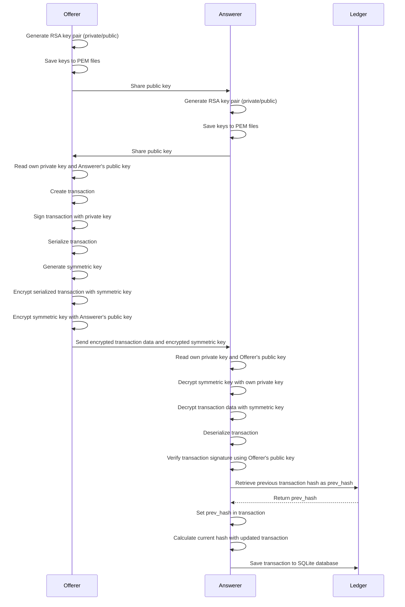

# CryptoTran

## Overview
CryptoTran is a Rust-based project designed to implement secure, encrypted transactions using asymmetric (RSA) and symmetric (AES-GCM) encryption. This project demonstrates a secure way to exchange transaction data between two parties (Offerer and Answerer), ensuring the confidentiality, integrity, and authenticity of the transactions.

## Key Features
- **RSA Key Pair Generation**: Generate RSA public and private keys for both Offerer and Answerer.
- **Transaction Signing**: Sign the transaction using the Offerer's private key.
- **Symmetric Key Generation**: Use AES-256 GCM for fast, secure encryption.
- **Secure Key Exchange**: Encrypt the AES symmetric key with the Answerer's public RSA key.
- **Data Storage**: Store completed transactions in a SQLite database, maintaining a hash-based linkage.

## How It Works
The process involves two primary participants, Offerer and Answerer, who securely exchange an encrypted transaction.

### Steps:
1. **Key Generation**: Both Offerer and Answerer generate RSA key pairs.
2. **Transaction Creation**: Offerer creates a transaction and signs it with their private RSA key.
3. **Symmetric Key Encryption**: The transaction is encrypted using an AES symmetric key.
4. **Key Exchange**: Offerer encrypts the AES key with Answerer's public RSA key and sends the encrypted data.
5. **Decryption and Verification**: Answerer decrypts the AES key, decrypts the transaction, and verifies Offerer's signature.
6. **Hash Linkage**: Answerer calculates the hash for the transaction, linking it to the last stored transaction for integrity.
7. **Database Storage**: The transaction is saved in the SQLite database with cryptographic integrity checks.

### Sequence Diagram
The sequence diagram below outlines the steps involved in the transaction exchange between Offerer and Answerer.


# change-ledger

### 1. Rustup 설치 파일 다운로드 및 실행

1. **PowerShell**을 열고 아래 명령어를 입력해 `rustup-init.exe` 파일을 다운로드합니다:

   ```powershell
   Invoke-WebRequest -Uri https://win.rustup.rs -OutFile rustup-init.exe
   ```

2. 다운로드한 **rustup-init.exe** 파일을 실행하여 설치를 시작합니다:

   ```powershell
   .\rustup-init.exe
   ```

3. 설치 중간에 **기본 설치 옵션**을 선택하면 Rust와 Cargo가 함께 설치됩니다.

### 2. 환경 변수 적용

설치가 완료되면 PowerShell을 닫았다가 다시 열어 **환경 변수를 새로 적용**한 후 아래 명령어로 설치가 잘 되었는지 확인합니다:

   ```powershell
   rustc --version
   cargo --version
   ```

이렇게 하면 Windows에서 Rust가 정상적으로 설치된 것입니다!

---

Visual Studio Code(VS Code)에서 Rust를 실행하려면 Rust의 개발 도구를 설정하고 확장 기능을 설치해야 합니다. 아래는 Windows에서 VS Code를 통해 Rust 코드를 작성하고 실행하는 방법입니다.

### 1. VS Code 설치 및 Rust 확장 설치

1. **VS Code**를 설치합니다. [VS Code 다운로드](https://code.visualstudio.com/Download) 페이지에서 설치 파일을 받습니다.
2. VS Code에서 **Rust 확장**을 설치합니다. 다음 두 가지 확장을 설치하는 것이 좋습니다:
   - **Rust** (rust-lang.rust): Rust의 기본 확장으로, 코드 완성, 오류 검사, 문법 강조와 같은 기능을 제공합니다.
   - **CodeLLDB** (vadimcn.vscode-lldb): Rust 코드를 디버깅할 수 있게 해줍니다.

이 두 확장을 설치하면 Rust 개발 환경이 구축됩니다.

### 2. Rust 프로젝트 생성

1. **터미널**을 열어 새 프로젝트를 생성합니다. VS Code에서 `Ctrl + ~`로 터미널을 열고, 아래 명령어를 실행해 새 Rust 프로젝트를 생성합니다:

   ```bash
   cargo new project_name
   ```

   예를 들어, 프로젝트 이름을 `hello_rust`로 하려면 `cargo new hello_rust` 명령을 실행합니다.

2. 생성된 프로젝트 폴더로 이동합니다.

   ```bash
   cd hello_rust
   ```

3. VS Code에서 프로젝트 폴더를 열어 Rust 소스 코드 파일을 볼 수 있습니다.

### 3. Rust 코드 작성 및 실행

1. `src/main.rs` 파일을 열어 코드 작성을 시작합니다. 기본 코드 예시는 다음과 같습니다:

   ```rust
   fn main() {
       println!("Hello, Rust with VS Code!");
   }
   ```

2. **빌드 및 실행**:
   - **빌드**: 터미널에서 `cargo build` 명령어를 입력하면 프로젝트가 빌드됩니다.
   - **실행**: 빌드된 프로젝트를 실행하려면 `cargo run` 명령어를 사용합니다.

   ```bash
   cargo run
   ```

3. 프로그램이 제대로 실행되면 `"Hello, Rust with VS Code!"`가 출력됩니다.

### 4. 디버깅

1. **Run and Debug** 탭(또는 `Ctrl+Shift+D`)을 열고 **Add Configuration...** 버튼을 눌러 **Cargo.toml** 파일이 있는 프로젝트를 선택합니다.
2. **Cargo: Run**을 선택하여 디버깅 설정을 추가합니다. `launch.json` 파일이 자동으로 생성되며, 이를 통해 Rust 프로그램을 디버깅할 수 있습니다.

VS Code에서 설정이 완료되었으니, 이제 Rust 코드 작성, 실행, 디버깅까지 한 곳에서 할 수 있습니다!
